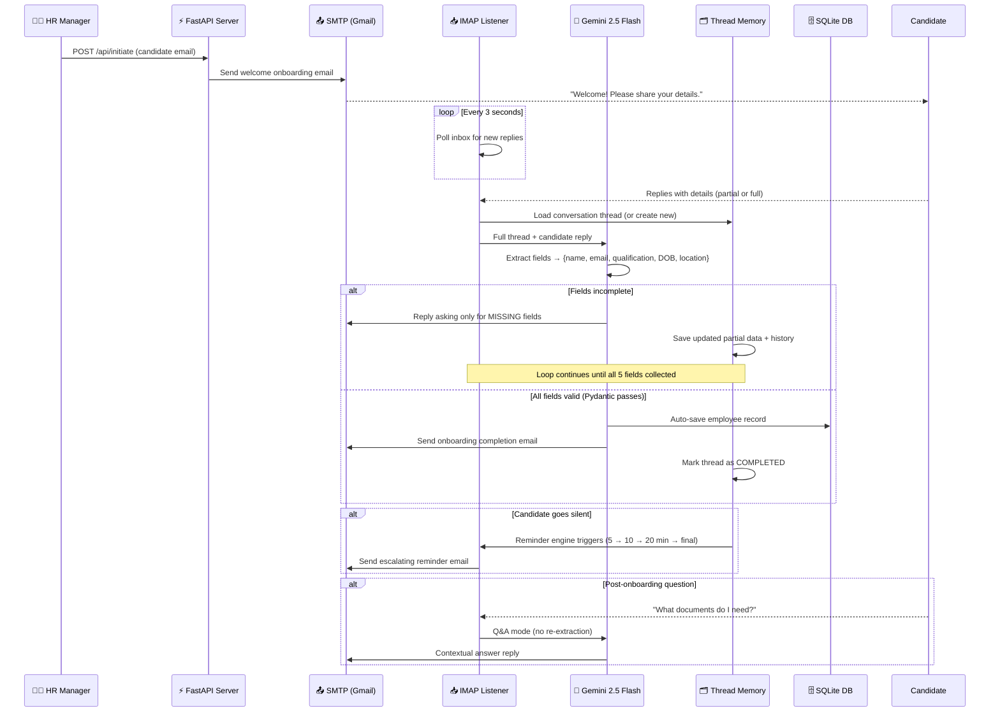

<div align="center">

# 🤖 Agentic HR Onboarding System

[](https://python.org)
[](https://fastapi.tiangolo.com)
[](https://ai.google.dev)
[](https://sqlite.org)
[](https://docs.pydantic.dev)
[](https://getbootstrap.com)

[](LICENSE)
[]()
[](https://github.com/GitbyShantanu)

<br/>

> **An autonomous, email-native AI agent that conducts end-to-end employee onboarding — no human follow-up required.**
>
> *The agent reads emails, extracts and validates structured data, asks follow-up questions for missing fields, persists multi-turn memory, and escalates reminders — all on its own.*

<br/>

[🚀 Getting Started](#-getting-started) · [🏗 Architecture](#-architecture) · [📡 API Reference](#-api-reference) · [🛠 Skills Demonstrated](#-skills-demonstrated)

</div>

---

## 🌟 What Makes This Different

This is **not** a chatbot. This is a **fully autonomous background agent** that operates through real email infrastructure. Once triggered, it:

- 📬 Monitors a live Gmail inbox via IMAP every **3 seconds**
- 🧠 Uses **Gemini 2.5 Flash** to read, understand, and reply to candidate emails
- 🔍 Extracts 5 structured fields (name, email, qualification, DOB, location) with **zero hallucination tolerance** — Pydantic validates every AI output
- 💬 Maintains **multi-turn conversation memory** (24h TTL) — asks only for what's missing
- 📂 **Auto-saves** verified employees to SQLite on completion
- ⏰ Fires a **3-tier escalating reminder** (5 → 10 → 20 min → final notice) if a candidate goes silent
- 🔄 Transitions to **Q&A mode** post-onboarding so candidates can ask questions naturally

---

## 🎬 System Flow



---

## 🏗 Architecture

### Key Design Decisions

| Decision | Choice | Why |
|---|---|---|
| **Conversation State** | JSON file-based (24h TTL) | Conversations are ephemeral — files are zero-config, fast, and survive server restarts without DB overhead |
| **Concurrency** | Python `threading` (daemon thread) | Single-server deployment — no Celery/Redis infrastructure needed; FastAPI lifespan manages lifecycle cleanly |
| **AI → Validation** | Pydantic v2 *after* Gemini extraction | AI output is never trusted directly. Pydantic acts as a strict trust boundary against hallucinated formats |
| **Agent Mode** | Dual-mode (data extraction + Q&A) | Single-reply handles both extraction *and* candidate questions for natural conversation flow |
| **Listener Lifecycle** | `asynccontextmanager` lifespan | Listener auto-starts on server boot, auto-stops on shutdown — zero manual management |

### Validation Rules (Pydantic v2)

- ✅ **Qualification**: Strict allowlist of 19 recognized degree types
- ✅ **Location**: Validated against 60+ Indian cities
- ✅ **DOB**: Must be a past date (rejects future dates and invalid formats)
- ✅ **Email**: RFC-compliant format validation
- ✅ **Name**: Non-empty, stripped, title-cased normalization

---

## 📁 Project Structure

```
Employee-OnBoarding-System/
│
├── backend/
│   ├── main.py               # FastAPI app — lifespan-managed email listener startup/shutdown
│   ├── database.py           # SQLAlchemy engine + session config
│   ├── models.py             # Employee ORM model
│   ├── schema.py             # Pydantic v2 schemas with strict field validators
│   ├── email_listener.py     # 🔑 Autonomous IMAP monitor + multi-stage reminder engine
│   └── routers/
│       ├── employee.py       # Full CRUD REST API (GET, POST, PUT, PATCH, DELETE)
│       └── email_agent.py    # AI onboarding agent + email initiator endpoint
│
└── frontend/
    ├── index.html            # HR dashboard (manual CRUD + AI text parser)
    ├── script.js             # API calls, pagination, toast notifications
    └── style.css             # Custom styles
```

---

## 📡 API Reference

### Employee CRUD

| Method | Endpoint | Description |
|---|---|---|
| `GET` | `/employees` | Paginated employee list |
| `POST` | `/employees` | Create employee manually |
| `GET` | `/employees/{id}` | Fetch single employee |
| `PUT` | `/employees/{id}` | Full update |
| `PATCH` | `/employees/{id}` | Partial update |
| `DELETE` | `/employees/{id}` | Remove employee |

### AI Agent & Email

| Method | Endpoint | Description |
|---|---|---|
| `POST` | `/api/initiate` | Trigger welcome email to a new hire |
| `POST` | `/api/ai-onboarding` | Multi-turn AI agent (manual text paste mode) |
| `GET` | `/api/listener/status` | Health check for the background IMAP listener |

---

## 🚀 Getting Started

### Prerequisites

- Python 3.10+
- A Gmail account with **App Password** enabled (2FA required)
- A Google AI Studio API key for Gemini

### 1. Clone the Repository

```bash
git clone https://github.com/GitbyShantanu/Employee-OnBoading-System.git
cd Employee-OnBoading-System
```

### 2. Install Dependencies

```bash
pip install -r requirements.txt
```

### 3. Configure Environment Variables

Create a `.env` file in the `backend/` directory:

```env
GOOGLE_API_KEY=your_gemini_api_key_here
EMAIL_USER=your_gmail_address@gmail.com
EMAIL_APP_PASSWORD=your_16_char_app_password
```

> 🔐 **Never commit your `.env` file.** It is already in `.gitignore`.

### 4. Run the Server

```bash
cd backend
uvicorn main:app --reload
```

The HR dashboard will be available at `http://127.0.0.1:8000`.  
The IMAP listener starts automatically in the background.

---

## 🛠 Skills Demonstrated

This project was built as a portfolio piece to showcase production-ready engineering across the full stack.

### 🤖 Agentic AI Engineering
- Autonomous multi-turn agent with persistent conversation memory
- Structured JSON extraction with Gemini 2.5 Flash (`temperature=0.1` for deterministic output)
- Dual-mode agent behavior (extraction mode → Q&A mode)
- Graceful handling of partial, incomplete, and ambiguous user input

### ⚙️ Backend Engineering
- FastAPI application with proper lifespan management (`asynccontextmanager`)
- SQLAlchemy ORM with clean model separation
- Pydantic v2 for strict schema validation (custom validators, allowlists, date enforcement)
- RESTful API design with full CRUD and appropriate HTTP semantics

### 🔁 Concurrency & System Design
- Background thread management (daemon threads, lifecycle-aware)
- IMAP + SMTP integration via Python standard library (`imaplib`, `smtplib`)
- Polling-based event loop with configurable intervals
- State machine design: `AWAITING → IN_PROGRESS → COMPLETED` per thread

### 🧹 Code Quality & Architecture
- Clear separation of concerns across routers, models, schemas, and services
- Environment-based configuration (no hardcoded secrets)
- File-based ephemeral state with TTL auto-cleanup
- Modular, readable codebase — easy to extend or swap components

---

## 🔮 Potential Extensions

- [ ] Replace SQLite with PostgreSQL for production scale
- [ ] Add Redis-backed memory for multi-instance deployments
- [ ] Build a recruiter-facing analytics dashboard (onboarding completion rates, response times)
- [ ] Support WhatsApp / Slack as alternate onboarding channels
- [ ] Containerize with Docker + `docker-compose`

---

## 👨‍💻 About

Built with 🛠 by **[Shantanu](https://github.com/GitbyShantanu)** — a Python & FastAPI developer focused on Agentic AI systems.

This project is part of my portfolio under **ShanTech** — a personal brand for projects at the intersection of AI and practical software engineering.

---

<div align="center">

*If this project impressed you, consider giving it a ⭐ — it means a lot!*

[](https://github.com/GitbyShantanu)

</div>